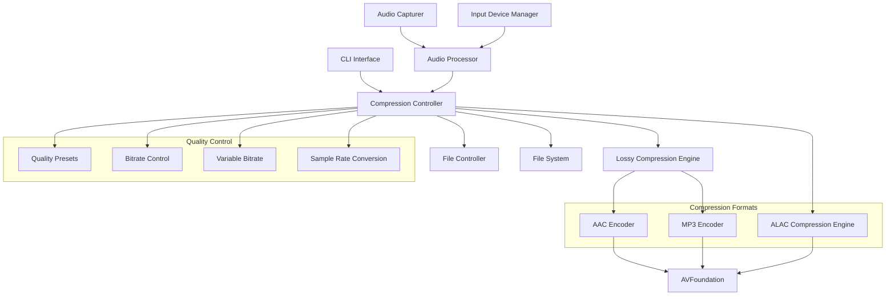

# Design Document

## Overview

The Lossy Audio Compression feature extends the Audio Process Recorder application with AAC and MP3 compression capabilities, building upon the existing ALAC lossless compression infrastructure. This feature leverages AVFoundation's native compression support to provide users with configurable lossy compression options that significantly reduce file sizes while maintaining acceptable audio quality. The design integrates seamlessly with existing recording workflows, multi-channel input capture, and real-time monitoring capabilities.

## Architecture

### High-Level Architecture



### Component Interaction Flow

1. **CLI Interface** parses compression flags (--aac, --mp3, --bitrate, --quality, --vbr, --sample-rate)
2. **Compression Controller** validates compression options and initializes appropriate encoder
3. **Lossy Compression Engine** manages AAC/MP3 encoding with configurable parameters
4. **Audio Processor** provides processed audio buffers to compression system
5. **File Controller** handles compressed file creation with appropriate extensions (.m4a, .mp3)
6. **Quality Control** subsystem manages bitrate, quality presets, and encoding parameters

## Components and Interfaces

### 1. Enhanced CLI Interface (`AudioRecorderCLI`)

**New Properties:**

```swift
struct AudioRecorderCLI: ParsableCommand {
    // Existing properties...
    
    @Flag(name: [.customShort("a"), .customLong("aac")], help: "Enable AAC compression for output files")
    var enableAAC: Bool = false
    
    @Flag(name: .long, help: "Enable MP3 compression for output files")
    var enableMP3: Bool = false
    
    @Option(name: [.customShort("b"), .customLong("bitrate")], help: "Set bitrate for lossy compression (64-320 kbps)")
    var bitrate: UInt32?
    
    @Option(name: [.customShort("q"), .customLong("quality")], help: "Set quality preset: low, medium, high, maximum")
    var quality: CompressionQuality?
    
    @Flag(name: .long, help: "Enable Variable Bitrate (VBR) encoding for AAC")
    var enableVBR: Bool = false
    
    @Option(name: .long, help: "Set sample rate for compression (22050, 44100, 48000)")
    var sampleRate: Double?
}

enum CompressionQuality: String, CaseIterable, ExpressibleByArgument {
    case low = "low"
    case medium = "medium"
    case high = "high"
    case maximum = "maximum"
    
    var bitrate: UInt32 {
        switch self {
        case .low: return 64
        case .medium: return 128
        case .high: return 192
        case .maximum: return 256
        }
    }
}
```

**Validation Logic:**

```swift
mutating func validate() throws {
    let compressionFlags = [enableALAC, enableAAC, enableMP3]
    let enabledCount = compressionFlags.filter { $0 }.count
    
    if enabledCount > 1 {
        throw ValidationError("Only one compression format can be enabled at a time")
    }
    
    if let bitrate = bitrate {
        guard bitrate >= 64 && bitrate <= 320 else {
            throw ValidationError("Bitrate must be between 64 and 320 kbps")
        }
        
        if !enableAAC && !enableMP3 {
            throw ValidationError("Bitrate option requires AAC or MP3 compression")
        }
    }
    
    if quality != nil && !enableAAC && !enableMP3 {
        throw ValidationError("Quality option requires AAC or MP3 compression")
    }
    
    if enableVBR && !enableAAC {
        throw ValidationError("VBR option is only available with AAC compression")
    }
}
```

### 2. Compression Controller (`CompressionController`)

**Responsibilities:**

- Coordinate between different compression engines
- Manage compression configuration and validation
- Handle compression format selection and parameter mapping
- Provide unified interface for audio compression operations

**Key Methods:**

```swift
class CompressionController {
    private var compressionEngine: CompressionEngineProtocol?
    private let configuration: CompressionConfiguration
    
    func initialize(with config: CompressionConfiguration) throws
    func processAudioBuffer(_ buffer: AVAudioPCMBuffer) throws -> Data?
    func finalizeCompression() throws -> CompressionStatistics
    func createOutputFile(at url: URL) throws -> AVAudioFile
    func validateConfiguration() throws
}

struct CompressionConfiguration {
    let format: CompressionFormat
    let bitrate: UInt32
    let quality: CompressionQuality?
    let enableVBR: Bool
    let sampleRate: Double?
    let channelCount: UInt32
    
    enum CompressionFormat {
        case aac
        case mp3
        case alac
        case uncompressed
    }
}
```

### 3. Lossy Compression Engine (`LossyCompressionEngine`)

**Responsibilities:**

- Implement AAC and MP3 encoding using AVFoundation
- Manage compression parameters and quality settings
- Handle real-time compression with performance monitoring
- Provide compression statistics and progress reporting

**Key Methods:**

```swift
class LossyCompressionEngine: CompressionEngineProtocol {
    private let encoder: AudioEncoderProtocol
    private let configuration: LossyCompressionConfiguration
    private var compressionStats: CompressionStatistics
    
    func initialize(configuration: LossyCompressionConfiguration) throws
    func encodeBuffer(_ buffer: AVAudioPCMBuffer) throws -> Data
    func finalize() throws -> CompressionStatistics
    func createAudioFile(at url: URL, format: AVAudioFormat) throws -> AVAudioFile
    func getCompressionRatio() -> Double
    func getEstimatedFileSize(for duration: TimeInterval) -> Int64
}

struct LossyCompressionConfiguration {
    let format: LossyFormat
    let bitrate: UInt32
    let enableVBR: Bool
    let sampleRate: Double
    let channelCount: UInt32
    let quality: AVAudioQuality
    
    enum LossyFormat {
        case aac
        case mp3
    }
}
```

### 4. AAC Encoder (`AACEncoder`)

**Responsibilities:**

- Configure AAC encoding parameters using AVFoundation
- Handle both CBR (Constant Bitrate) and VBR (Variable Bitrate) encoding
- Optimize AAC settings for different quality presets
- Support multi-channel AAC encoding up to 8 channels

**Implementation Details:**

```swift
class AACEncoder: AudioEncoderProtocol {
    private var audioFile: AVAudioFile?
    private let settings: [String: Any]
    
    func createAACSettings(bitrate: UInt32, sampleRate: Double, channelCount: UInt32, enableVBR: Bool) -> [String: Any] {
        var settings: [String: Any] = [
            AVFormatIDKey: kAudioFormatMPEG4AAC,
            AVNumberOfChannelsKey: channelCount,
            AVSampleRateKey: sampleRate,
            AVEncoderAudioQualityKey: AVAudioQuality.high.rawValue
        ]
        
        if enableVBR {
            settings[AVEncoderBitRateStrategyKey] = AVAudioBitRateStrategy_Variable
            settings[AVEncoderAudioQualityForVBRKey] = qualityForBitrate(bitrate)
        } else {
            settings[AVEncoderBitRateKey] = bitrate * 1000 // Convert to bits per second
            settings[AVEncoderBitRateStrategyKey] = AVAudioBitRateStrategy_Constant
        }
        
        return settings
    }
    
    private func qualityForBitrate(_ bitrate: UInt32) -> AVAudioQuality {
        switch bitrate {
        case 64...96: return .medium
        case 97...160: return .high
        case 161...320: return .max
        default: return .high
        }
    }
}
```

**AAC Format Configuration:**

```swift
let aacFormat = AVAudioFormat(
    commonFormat: .pcmFormatFloat32,
    sampleRate: sampleRate,
    channels: AVAudioChannelCount(channelCount),
    interleaved: false
)

let aacFile = try AVAudioFile(
    forWriting: outputURL,
    settings: aacSettings,
    commonFormat: .pcmFormatFloat32,
    interleaved: false
)
```

### 5. MP3 Encoder (`MP3Encoder`)

**Responsibilities:**

- Configure MP3 encoding parameters using AVFoundation
- Handle MP3-specific quality settings and bitrate management
- Ensure compatibility across different platforms and players
- Support multi-channel MP3 encoding (up to stereo for maximum compatibility)

**Implementation Details:**

```swift
class MP3Encoder: AudioEncoderProtocol {
    private var audioFile: AVAudioFile?
    private let settings: [String: Any]
    
    func createMP3Settings(bitrate: UInt32, sampleRate: Double, channelCount: UInt32) -> [String: Any] {
        // MP3 typically limited to stereo for maximum compatibility
        let mp3ChannelCount = min(channelCount, 2)
        
        return [
            AVFormatIDKey: kAudioFormatMPEGLayer3,
            AVNumberOfChannelsKey: mp3ChannelCount,
            AVSampleRateKey: sampleRate,
            AVEncoderBitRateKey: bitrate * 1000,
            AVEncoderAudioQualityKey: AVAudioQuality.high.rawValue,
            AVSampleRateConverterAudioQualityKey: AVAudioQuality.max.rawValue
        ]
    }
}
```

### 6. Enhanced Audio Processor (`AudioProcessor`)

**New Responsibilities:**

- Route audio buffers to appropriate compression engine
- Handle sample rate conversion for lossy compression
- Manage audio format conversion for different compression formats
- Coordinate multi-channel audio processing with compression

**Enhanced Methods:**

```swift
class AudioProcessor {
    private var compressionController: CompressionController?
    
    func setCompressionController(_ controller: CompressionController) {
        self.compressionController = controller
    }
    
    func processAudioForCompression(_ buffer: AVAudioPCMBuffer) throws -> AVAudioPCMBuffer? {
        guard let compressionController = compressionController else {
            return buffer // No compression, return original
        }
        
        // Apply sample rate conversion if needed
        let processedBuffer = try applySampleRateConversion(buffer)
        
        // Apply any pre-compression processing
        return try applyPreCompressionProcessing(processedBuffer)
    }
    
    private func applySampleRateConversion(_ buffer: AVAudioPCMBuffer) throws -> AVAudioPCMBuffer {
        // Implementation for sample rate conversion using AVAudioConverter
    }
}
```

### 7. Enhanced File Controller (`FileController`)

**New Responsibilities:**

- Handle compressed file creation with appropriate extensions
- Manage compression-specific file naming conventions
- Create compression statistics files alongside audio files
- Handle fallback file creation when compression fails

**Enhanced Methods:**

```swift
class FileController {
    func createCompressedAudioFile(
        at directory: String,
        format: CompressionFormat,
        audioFormat: AVAudioFormat
    ) throws -> (audioFile: AVAudioFile, url: URL) {
        
        let filename = generateTimestampedFilename(extension: format.fileExtension)
        let url = URL(fileURLWithPath: directory).appendingPathComponent(filename)
        
        let settings = try createCompressionSettings(for: format, audioFormat: audioFormat)
        let audioFile = try AVAudioFile(forWriting: url, settings: settings)
        
        return (audioFile, url)
    }
    
    func writeCompressionStatistics(
        _ stats: CompressionStatistics,
        to directory: String
    ) throws -> URL {
        let filename = generateTimestampedFilename(extension: "json")
        let url = URL(fileURLWithPath: directory).appendingPathComponent(filename)
        
        let data = try JSONEncoder().encode(stats)
        try data.write(to: url)
        
        return url
    }
}

extension CompressionFormat {
    var fileExtension: String {
        switch self {
        case .aac: return "m4a"
        case .mp3: return "mp3"
        case .alac: return "m4a"
        case .uncompressed: return "caf"
        }
    }
}
```

## Data Models

### Compression Configuration Model

```swift
struct CompressionConfiguration: Codable {
    let format: CompressionFormat
    let bitrate: UInt32
    let quality: CompressionQuality?
    let enableVBR: Bool
    let sampleRate: Double
    let channelCount: UInt32
    let enableMultiChannel: Bool
    
    enum CompressionFormat: String, Codable, CaseIterable {
        case aac = "aac"
        case mp3 = "mp3"
        case alac = "alac"
        case uncompressed = "uncompressed"
        
        var displayName: String {
            switch self {
            case .aac: return "AAC"
            case .mp3: return "MP3"
            case .alac: return "ALAC (Lossless)"
            case .uncompressed: return "Uncompressed"
            }
        }
        
        var isLossy: Bool {
            return self == .aac || self == .mp3
        }
    }
    
    enum CompressionQuality: String, Codable, CaseIterable {
        case low = "low"
        case medium = "medium"
        case high = "high"
        case maximum = "maximum"
        
        var bitrate: UInt32 {
            switch self {
            case .low: return 64
            case .medium: return 128
            case .high: return 192
            case .maximum: return 256
            }
        }
        
        var description: String {
            switch self {
            case .low: return "Low (64 kbps) - Maximum compression"
            case .medium: return "Medium (128 kbps) - Balanced quality/size"
            case .high: return "High (192 kbps) - High quality"
            case .maximum: return "Maximum (256 kbps) - Near-transparent quality"
            }
        }
    }
}
```

### Compression Statistics Model

```swift
struct CompressionStatistics: Codable {
    let sessionId: UUID
    let format: CompressionFormat
    let startTime: Date
    let endTime: Date
    let duration: TimeInterval
    
    // File size information
    let originalSize: Int64
    let compressedSize: Int64
    let compressionRatio: Double
    let fileSizeReduction: Double
    
    // Audio quality information
    let bitrate: UInt32
    let sampleRate: Double
    let channelCount: UInt32
    let enabledVBR: Bool
    
    // Performance metrics
    let encodingTime: TimeInterval
    let averageEncodingSpeed: Double // MB/s
    let cpuUsagePercent: Double
    let memoryUsageMB: Double
    
    // Quality metrics
    let averageBitrate: UInt32? // For VBR encoding
    let peakBitrate: UInt32? // For VBR encoding
    let qualityScore: Double? // Estimated quality score
    
    var fileSizeReductionPercentage: Double {
        return fileSizeReduction * 100.0
    }
    
    var compressionEfficiency: String {
        switch compressionRatio {
        case 0.0..<0.1: return "Excellent (>90% reduction)"
        case 0.1..<0.2: return "Very Good (80-90% reduction)"
        case 0.2..<0.3: return "Good (70-80% reduction)"
        case 0.3..<0.5: return "Moderate (50-70% reduction)"
        default: return "Low (<50% reduction)"
        }
    }
}
```

### Audio Encoder Protocol

```swift
protocol AudioEncoderProtocol {
    func initialize(configuration: LossyCompressionConfiguration) throws
    func encode(buffer: AVAudioPCMBuffer) throws -> Data
    func finalize() throws -> CompressionStatistics
    func createAudioFile(at url: URL, format: AVAudioFormat) throws -> AVAudioFile
    func getEstimatedFileSize(for duration: TimeInterval) -> Int64
    func getCompressionRatio() -> Double
    func supportsMultiChannel() -> Bool
    func getMaximumChannelCount() -> UInt32
}

protocol CompressionEngineProtocol {
    func processAudioBuffer(_ buffer: AVAudioPCMBuffer) throws -> Data?
    func createOutputFile(at url: URL, format: AVAudioFormat) throws -> AVAudioFile
    func finalizeCompression() throws -> CompressionStatistics
    func getCompressionProgress() -> CompressionProgress
}

struct CompressionProgress {
    let bytesProcessed: Int64
    let estimatedTotalBytes: Int64
    let compressionRatio: Double
    let encodingSpeed: Double // MB/s
    let timeRemaining: TimeInterval?
}
```

## Error Handling

### Enhanced Error Types

```swift
enum AudioRecorderError: LocalizedError {
    // Existing errors...
    
    // Compression-specific errors
    case compressionNotSupported(CompressionFormat)
    case compressionConfigurationInvalid(String)
    case compressionEncodingFailed(CompressionFormat, Error)
    case compressionFallbackFailed(Error)
    case bitrateNotSupported(UInt32, CompressionFormat)
    case sampleRateConversionFailed(Double, Double, Error)
    case vbrNotSupported(CompressionFormat)
    case multiChannelNotSupported(CompressionFormat, UInt32)
    
    var errorDescription: String? {
        switch self {
        case .compressionNotSupported(let format):
            return "Compression format \(format.displayName) is not supported on this system"
        case .compressionConfigurationInvalid(let reason):
            return "Invalid compression configuration: \(reason)"
        case .compressionEncodingFailed(let format, let error):
            return "Failed to encode audio using \(format.displayName): \(error.localizedDescription)"
        case .compressionFallbackFailed(let error):
            return "Compression failed and fallback to uncompressed recording also failed: \(error.localizedDescription)"
        case .bitrateNotSupported(let bitrate, let format):
            return "Bitrate \(bitrate) kbps is not supported for \(format.displayName) format"
        case .sampleRateConversionFailed(let from, let to, let error):
            return "Failed to convert sample rate from \(from) Hz to \(to) Hz: \(error.localizedDescription)"
        case .vbrNotSupported(let format):
            return "Variable bitrate encoding is not supported for \(format.displayName) format"
        case .multiChannelNotSupported(let format, let channels):
            return "\(format.displayName) format does not support \(channels) channels"
        }
    }
    
    var recoverySuggestion: String? {
        switch self {
        case .compressionNotSupported:
            return "Try using a different compression format or uncompressed recording"
        case .compressionConfigurationInvalid:
            return "Check your compression settings and try again"
        case .compressionEncodingFailed:
            return "The system will automatically fallback to uncompressed recording"
        case .bitrateNotSupported:
            return "Use a bitrate between 64-320 kbps for lossy compression"
        case .sampleRateConversionFailed:
            return "Try using the original sample rate or a standard rate (44100/48000 Hz)"
        case .vbrNotSupported:
            return "Variable bitrate is only supported with AAC compression"
        case .multiChannelNotSupported:
            return "Consider using fewer channels or a different compression format"
        default:
            return nil
        }
    }
}
```

### Compression Fallback Strategy

```swift
class CompressionFallbackManager {
    func handleCompressionFailure(
        originalConfig: CompressionConfiguration,
        error: Error
    ) -> CompressionConfiguration {
        
        switch error {
        case AudioRecorderError.compressionEncodingFailed:
            // Fallback to uncompressed
            return CompressionConfiguration(
                format: .uncompressed,
                bitrate: 0,
                quality: nil,
                enableVBR: false,
                sampleRate: originalConfig.sampleRate,
                channelCount: originalConfig.channelCount,
                enableMultiChannel: originalConfig.enableMultiChannel
            )
            
        case AudioRecorderError.bitrateNotSupported:
            // Fallback to default bitrate
            var fallbackConfig = originalConfig
            fallbackConfig.bitrate = 128
            return fallbackConfig
            
        case AudioRecorderError.multiChannelNotSupported:
            // Fallback to stereo
            var fallbackConfig = originalConfig
            fallbackConfig.channelCount = 2
            fallbackConfig.enableMultiChannel = false
            return fallbackConfig
            
        default:
            // Ultimate fallback to uncompressed
            return CompressionConfiguration(
                format: .uncompressed,
                bitrate: 0,
                quality: nil,
                enableVBR: false,
                sampleRate: originalConfig.sampleRate,
                channelCount: originalConfig.channelCount,
                enableMultiChannel: originalConfig.enableMultiChannel
            )
        }
    }
}
```

## Testing Strategy

### Unit Testing

- **Compression Configuration**: Test CLI argument parsing, validation, and configuration creation
- **AAC Encoding**: Test AAC format creation, bitrate settings, VBR configuration, and multi-channel support
- **MP3 Encoding**: Test MP3 format creation, bitrate settings, and compatibility constraints
- **Sample Rate Conversion**: Test audio format conversion between different sample rates
- **Error Handling**: Test compression failures, fallback mechanisms, and error recovery
- **Statistics Calculation**: Test compression ratio calculation, file size estimation, and performance metrics

### Integration Testing

- **End-to-End Compression**: Test complete recording workflows with different compression formats
- **Multi-Channel Compression**: Test compressed recording with input device capture
- **Performance Testing**: Test compression performance under various system loads
- **Compatibility Testing**: Test compressed file playback across different applications
- **Fallback Testing**: Test automatic fallback when compression fails during recording

### Testing Framework

```swift
class LossyCompressionTests: XCTestCase {
    func testAACCompressionConfiguration()
    func testMP3CompressionConfiguration()
    func testCompressionQualityPresets()
    func testBitrateValidation()
    func testVBREncoding()
    func testSampleRateConversion()
    func testMultiChannelCompression()
    func testCompressionFallback()
    func testCompressionStatistics()
    func testFileExtensionMapping()
    func testCompressionPerformance()
    func testErrorHandling()
}

// Mock implementations for testing
class MockAACEncoder: AudioEncoderProtocol
class MockMP3Encoder: AudioEncoderProtocol
class MockCompressionController: CompressionEngineProtocol
```

## Implementation Notes

### AVFoundation Integration

- **AAC Encoding**: Uses `kAudioFormatMPEG4AAC` with configurable bitrate and VBR support
- **MP3 Encoding**: Uses `kAudioFormatMPEGLayer3` with standard bitrate options
- **Multi-Channel Support**: AAC supports up to 8 channels, MP3 limited to stereo for compatibility
- **Sample Rate Conversion**: Uses `AVAudioConverter` for efficient sample rate conversion
- **Real-Time Encoding**: Optimized for real-time compression during recording

### Performance Optimizations

- **Background Encoding**: Use dedicated encoding queues to prevent audio dropouts
- **Buffer Management**: Optimize buffer sizes for compression efficiency vs. latency
- **Memory Pool**: Pre-allocate and reuse compression buffers
- **CPU Monitoring**: Track encoding CPU usage and adjust parameters dynamically
- **Compression Caching**: Cache encoder state for consistent performance

### Quality Considerations

- **Bitrate Selection**: Provide intelligent defaults based on content type and use case
- **VBR Benefits**: Variable bitrate provides better quality for complex audio content
- **Sample Rate Impact**: Lower sample rates reduce file size but may affect audio quality
- **Multi-Channel Efficiency**: Balance channel count with compression efficiency
- **Format Selection**: AAC generally provides better quality than MP3 at equivalent bitrates

### Compatibility and Standards

- **AAC Compatibility**: Use AAC-LC profile for maximum compatibility
- **MP3 Standards**: Follow MPEG-1 Layer III standards for universal playback
- **Container Formats**: Use M4A for AAC, MP3 for MP3 files
- **Metadata Support**: Preserve audio metadata in compressed files
- **Platform Support**: Ensure compatibility across macOS versions and audio applications