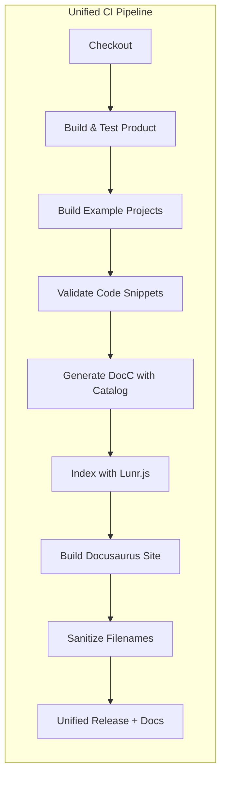

# Design Document

## Overview

The SDK Documentation system provides a full developer experience for integrating **AudioCap Core** into third-party applications. It combines an auto-generated API reference (Swift-DocC), curated conceptual guides, integration recipes, and CI-validated sample projects into a versioned static documentation site deployed with each release tag. The objective is to minimise time-to-first-audio for integrators while ensuring that documentation accuracy is continuously enforced by the build pipeline.

## Architecture

The solution is built around three main workflows:

1. **Documentation Authoring** – Maintainers write Markdown guides and recipes in the `Docs/` directory, plus a DocC catalog in `Documentation.docc/` for API reference landing pages. Code snippets are validated through CI compilation testing.
2. **API Reference Generation** – A custom DocGen tool invokes `docc convert` with the Documentation.docc catalog and dynamically discovered symbol graphs to produce HTML/JSON documentation bundles. This replaces direct SwiftPM plugin usage due to DocC catalog requirements.
3. **Site Assembly & Deployment** – A unified GitHub Actions CI workflow integrates documentation building with product releases, stitching together authored content, generated API docs, and sample project artefacts into a static site deployed to GitHub Pages under versioned paths. Documentation is released synchronously with product versions using semantic versioning.

## Components and Interfaces

| Component | Responsibility | Interfaces |
|-----------|---------------|------------|
| **Doc Authoring Toolkit** | Collection of Markdown guides and recipes in `Docs/`, plus DocC catalog in `Documentation.docc/`. | `.md` files and DocC catalog with main documentation page. |
| **DocGen Tool** | Custom Swift executable that invokes `docc convert` with Documentation.docc catalog and dynamic symbol graph discovery. | Invoked via `swift run docgen`. Outputs HTML & JSON bundle to `build/docs`. |
| **Sample Projects** | SwiftPM example projects demonstrating QuickStart, MonoRecording, MultiChannel, and AdaptiveBitrate integrations. | Located in `Examples/`; validated by CI build matrix for all targets. |
| **Docs Site Builder** | Docusaurus-based static site generator that imports DocC bundles, authored guides, and search indexes. | `docs-site/` project; `npm run build` with prebuild hooks. |
| **Search Indexer** | Node.js script that generates lunr.js index from DocC JSON output with performance benchmarking. | `Tools/DocsIndexer/` with <200ms search validation. |
| **Version Management** | Scripts that read `semver.yaml` and generate `versions.json` for Docusaurus versioning. | Build-time manifest with semantic versioning support. |
| **Filename Sanitizer** | CI step that sanitizes filenames and directory names for cross-platform artifact compatibility. | Handles DocC-generated names with problematic characters (colons, etc.). |
| **Unified CI Workflow** | Single `.github/workflows/ci.yml` integrates product build, documentation generation, and synchronized releases. | Triggered on `push` to `main`; creates unified product+docs releases. |

## Data Models

1. **Symbol Index** – JSON produced by DocC (`symbol-graph.json`) containing identifiers, declarations, availability, and deprecation flags.
2. **Guide Metadata** – Front-matter in Markdown guides (title, description, tags, minimum SDK version, sample-project path).
3. **Version Manifest** – `versions.json` list with `{ version, url, latest }` used by the version switcher.

## Error Handling

* **Build-time failures**: Any broken code snippet or sample project causes the CI job to fail, preventing deployment.
* **Link validation**: Docusaurus built-in link checking validates internal links and fails the build if broken links are detected.
* **Filename compatibility**: Automatic sanitization of DocC-generated filenames containing problematic characters (colons, quotes, etc.) for cross-platform artifact compatibility.
* **Missing dependencies**: CI uses `npm install` instead of `npm ci` to handle missing lock files gracefully.
* **Symbol graph discovery**: Dynamic discovery of symbol graph directories to handle different build environments and architectures.
* **Deprecations**: Deprecated symbols are annotated by DocC; guides include callouts with alternatives.

## Testing Strategy

1. **Code Snippet Validation** – CI workflow includes a dedicated "Validate Code Snippets" step that checks Swift code blocks in documentation for compilation errors.
2. **Sample Project CI Matrix** – Each example project in `Examples/` is built individually as separate CI jobs to ensure all integrations work correctly.
3. **Documentation Build Verification** – Complete pipeline from DocC generation through Docusaurus site build, including search index generation and performance benchmarking.
4. **Link Integrity Checking** – Docusaurus built-in link validation prevents broken internal links from being deployed.
5. **Cross-Platform Compatibility** – Filename sanitization ensures documentation artifacts work across different file systems (NTFS, etc.).
6. **Unified Release Testing** – Documentation is built and tested as part of the main product CI pipeline, ensuring synchronization between product and docs versions.

---

### Design Decisions & Rationale

* **Swift-DocC with Custom Catalog** is chosen for API reference as it integrates natively with SwiftPM while allowing custom documentation structure through the `Documentation.docc` catalog approach.
* **Custom DocGen Tool** replaces direct SwiftPM plugin usage to provide better control over symbol graph discovery and DocC invocation, handling different build environments robustly.
* **Docusaurus** is selected for site assembly to leverage Markdown MDX flexibility, integrated search, built-in link validation, and easy versioning.
* **Unified CI Pipeline** integrates documentation building with product releases to ensure version synchronization and reduce CI complexity.
* **Comprehensive Error Handling** includes filename sanitization, dynamic symbol graph discovery, and graceful dependency handling to ensure reliable builds across different environments.
* **CI-validated snippets** guarantee that documentation never drifts from the code-base, reducing maintenance burden.
* **Semantic Versioning Integration** ensures documentation versions match product versions for consistent developer experience.
