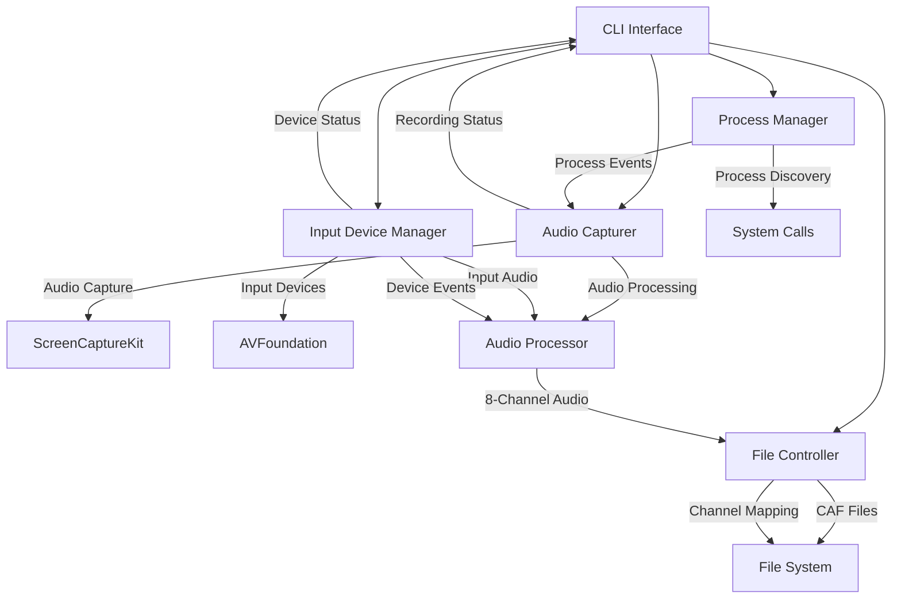

# Design Document

## Overview

The Audio Process Recorder is a command-line macOS application built with Swift that captures system audio using ScreenCaptureKit and filters it to record audio from specific processes identified by regular expression matching. The application leverages macOS Sequoia 15.6's ScreenCaptureKit framework to capture all system audio, then correlates this audio with target process activity to create filtered recordings. Additionally, the application can simultaneously capture all available audio input devices and combine them into an 8-channel CAF file, with process audio on channels 1-2 and input devices on channels 3-8, supporting hot-swapping of devices during recording.

## Architecture

### High-Level Architecture



### Component Interaction Flow

1. **CLI Interface** parses command-line arguments and coordinates other components
2. **Process Manager** discovers and monitors target processes using regex matching
3. **Audio Capturer** uses ScreenCaptureKit to capture system audio and correlates it with process activity
4. **Input Device Manager** enumerates, monitors, and captures from all available audio input devices
5. **Audio Processor** filters and mixes audio streams from target processes and combines with input device audio into 8-channel format
6. **File Controller** manages 8-channel CAF file creation, channel mapping logs, directory structure, and timestamped naming

## Components and Interfaces

### 1. CLI Interface (`AudioRecorderCLI`)

**Responsibilities:**

- Parse command-line arguments using Swift ArgumentParser
- Validate input parameters and permissions
- Coordinate application lifecycle
- Display real-time recording feedback

**Key Properties:**

```swift
struct AudioRecorderCLI: ParsableCommand {
    @Argument(help: "Regular expression to match process names")
    var processRegex: String

    @Option(name: .shortAndLong, help: "Output directory for recordings")
    var outputDirectory: String?

    @Flag(name: .shortAndLong, help: "Enable verbose logging")
    var verbose: Bool = false

    @Flag(name: .shortAndLong, help: "Capture all audio input devices in addition to process audio")
    var captureInputs: Bool = false
}
```

**Interfaces:**

- `ProcessManagerDelegate` - Receives process discovery updates
- `AudioCapturerDelegate` - Receives recording status and duration updates
- `InputDeviceManagerDelegate` - Receives input device connection/disconnection events

### 2. Process Manager (`ProcessManager`)

**Responsibilities:**

- Discover running processes using macOS system APIs
- Filter processes using regex matching against executable names and paths
- Monitor process lifecycle (start/stop events)
- Provide process metadata for audio correlation

**Key Methods:**

```swift
class ProcessManager {
    func discoverProcesses(matching regex: String) -> [ProcessInfo]
    func startMonitoring(delegate: ProcessManagerDelegate)
    func stopMonitoring()
}

struct ProcessInfo {
    let pid: pid_t
    let executableName: String
    let executablePath: String
    let bundleIdentifier: String?
}
```

**Implementation Details:**

- Uses `NSRunningApplication` for high-level process discovery
- Falls back to `sysctl` system calls for comprehensive process enumeration
- Implements regex matching using `NSRegularExpression`
- Monitors process events using `NSWorkspace` notifications

### 3. Input Device Manager (`InputDeviceManager`)

**Responsibilities:**

- Enumerate all available audio input devices using AVFoundation
- Monitor device connection/disconnection events (hot-swapping)
- Manage audio capture from up to 6 input devices simultaneously
- Provide device metadata and channel assignment information
- Handle device-specific audio format configuration

**Key Methods:**

```swift
class InputDeviceManager {
    func enumerateInputDevices() -> [AudioInputDevice]
    func startCapturing(devices: [AudioInputDevice], delegate: InputDeviceManagerDelegate)
    func stopCapturing()
    func handleDeviceConnectionChange(_ notification: Notification)
    private func isPhysicalInputDevice(_ deviceID: AudioDeviceID) -> Bool
    private func filterAggregateAndVirtualDevices(_ devices: [AudioInputDevice]) -> [AudioInputDevice]
}

struct AudioInputDevice {
    let deviceID: AudioDeviceID
    let name: String
    let uid: String
    let channelCount: Int
    let sampleRate: Double
    let deviceType: AudioDeviceType
    var assignedChannel: Int?
    var isConnected: Bool
}

enum AudioDeviceType {
    case physical
    case aggregate
    case virtual
    case unknown
}

protocol InputDeviceManagerDelegate: AnyObject {
    func deviceConnected(_ device: AudioInputDevice, assignedToChannel channel: Int)
    func deviceDisconnected(_ device: AudioInputDevice, fromChannel channel: Int)
    func audioDataReceived(from device: AudioInputDevice, buffer: AVAudioPCMBuffer)
}
```

**Implementation Details:**

- Uses `AVAudioSession` and `AVAudioEngine` for input device management
- Monitors `AVAudioSession.routeChangeNotification` for device hot-swapping
- Implements channel assignment logic (channels 3-8 for input devices)
- Handles device-specific sample rate conversion to match 48kHz output
- Manages device reconnection and channel reassignment
- Filters out aggregate and virtual audio devices using Core Audio device type detection

**Device Filtering Strategy:**

- Uses Core Audio's `AudioObjectGetPropertyData` with `kAudioDevicePropertyDeviceManufacturerCFString` and `kAudioDevicePropertyTransportType` to identify device types
- Excludes devices with transport type `kAudioDeviceTransportTypeAggregate`
- Excludes devices with transport type `kAudioDeviceTransportTypeVirtual`
- Excludes devices where manufacturer contains "Aggregate" or "Virtual" keywords
- Maintains a filtered device list that only includes physical hardware devices (USB, built-in, Bluetooth, etc.)
- Logs excluded devices with their type and reason for debugging purposes

### 4. Audio Capturer (`AudioCapturer`)

**Responsibilities:**

- Configure and manage ScreenCaptureKit audio capture
- Correlate captured audio with target process activity
- Handle audio permissions and error states
- Provide real-time recording feedback

**Key Methods:**

```swift
class AudioCapturer: SCStreamDelegate {
    func startCapture(for processes: [ProcessInfo]) throws
    func stopCapture()
    func stream(_ stream: SCStream, didOutputSampleBuffer sampleBuffer: CMSampleBuffer, of outputType: SCStreamOutputType)
}
```

**ScreenCaptureKit Configuration:**

```swift
let streamConfig = SCStreamConfiguration()
streamConfig.capturesAudio = true
streamConfig.sampleRate = 48000
streamConfig.channelCount = 2
streamConfig.excludesCurrentProcessAudio = true
```

**Audio Correlation Strategy:**

- Capture all system audio via ScreenCaptureKit
- Monitor process CPU/memory usage to detect audio activity
- Use audio level analysis to identify when target processes are generating sound
- Apply temporal correlation between process activity and audio peaks

### 5. Audio Processor (`AudioProcessor`)

**Responsibilities:**

- Process raw audio sample buffers from ScreenCaptureKit
- Filter audio based on process correlation data
- Mix multiple process audio streams
- Combine process audio with input device audio into 8-channel format
- Convert multi-channel audio for CAF file output

**Key Methods:**

```swift
class AudioProcessor {
    func processAudioBuffer(_ buffer: CMSampleBuffer, from processes: [ProcessInfo]) -> AVAudioPCMBuffer?
    func mixAudioStreams(_ streams: [AVAudioPCMBuffer]) -> AVAudioPCMBuffer?
    func combineWithInputDevices(_ processAudio: AVAudioPCMBuffer, inputAudio: [Int: AVAudioPCMBuffer]) -> AVAudioPCMBuffer
    func convertToMultiChannelWAV(_ buffer: AVAudioPCMBuffer) -> Data
}
```

**8-Channel Audio Processing Pipeline:**

1. Convert CMSampleBuffer to AVAudioPCMBuffer (process audio)
2. Apply process-based filtering using correlation data
3. Mix audio from multiple target processes (channels 1-2)
4. Receive input device audio buffers mapped to channels 3-8
5. Combine process audio and input device audio into single 8-channel buffer
6. Apply sample rate conversion and format normalization
7. Output as 8-channel CAF using AVAudioFile (Linear PCM)

**Channel Assignment:**

- Channels 1-2: Process audio (stereo mix of target processes)
- Channels 3-8: Input devices (up to 6 devices, one per channel)
- Unused channels: Silent (zero-filled)

### 6. File Controller (`FileController`)

**Responsibilities:**

- Manage output directory creation and permissions
- Generate timestamped filenames for audio and mapping files
- Write 8-channel CAF data to files
- Create and maintain channel mapping log files
- Handle file system errors and disk space monitoring

**Key Methods:**

```swift
class FileController {
    func createOutputDirectory(_ path: String) throws
    func generateTimestampedFilename(extension: String = "wav") -> String
    func writeMultiChannelAudioData(_ data: Data, to directory: String) throws -> URL
    func writeChannelMappingLog(_ mapping: ChannelMapping, to directory: String) throws -> URL
    func updateChannelMappingLog(with event: DeviceEvent, at url: URL) throws
}

struct ChannelMapping {
    let sessionId: UUID
    let startTime: Date
    var channelAssignments: [Int: AudioInputDevice] // Channel number -> Device
    var deviceEvents: [DeviceEvent]
}

struct DeviceEvent {
    let timestamp: Date
    let device: AudioInputDevice
    let event: EventType
    let channel: Int?

    enum EventType {
        case connected
        case disconnected
        case reassigned
    }
}
```

**File Naming Convention:**

- Audio files: `yyyy-MM-dd-HH-mm-ss.caf` (8-channel CAF)
- Channel mapping: `yyyy-MM-dd-HH-mm-ss-channels.json`
- Default location: `~/Documents/audiocap/`
- Automatic directory creation with proper permissions

## Data Models

### Process Information Model

```swift
struct ProcessInfo: Codable {
    let pid: pid_t
    let executableName: String
    let executablePath: String
    let bundleIdentifier: String?
    let startTime: Date
    var isActive: Bool
    var audioActivity: AudioActivityLevel
}

enum AudioActivityLevel {
    case silent
    case low
    case medium
    case high
}
```

### Recording Session Model

```swift
struct RecordingSession {
    let sessionId: UUID
    let startTime: Date
    var endTime: Date?
    let targetProcesses: [ProcessInfo]
    let outputFile: URL
    var duration: TimeInterval
    var fileSize: Int64
}
```

### Audio Configuration Model

```swift
struct AudioConfiguration {
    let sampleRate: Int = 48000
    let processChannelCount: Int = 1
    let inputDeviceChannelCount: Int = 7
    let totalChannelCount: Int = 8
    let bitDepth: Int = 16
    let maxDurationHours: Int = 12
    let bufferSize: Int = 4096
    let maxInputDevices: Int = 7
}
```

## Error Handling

### Error Types

```swift
enum AudioRecorderError: LocalizedError {
    case permissionDenied(PermissionType)
    case processNotFound(String)
    case audioCaptureFailed(SCStreamError)
    case inputDeviceError(InputDeviceError)
    case fileSystemError(Error)
    case invalidRegex(String)
    case configurationError(String)

    enum PermissionType {
        case screenRecording
        case microphone
        case fileSystem
        case accessibility
    }

    enum InputDeviceError {
        case deviceNotFound(String)
        case deviceUnavailable(String)
        case formatNotSupported(String)
        case channelLimitExceeded(Int)
        case deviceFilteringFailed(String)
        case noPhysicalDevicesAvailable
    }
}
```

### Error Handling Strategy

- **Permission Errors**: Display step-by-step instructions for enabling required permissions
- **Process Errors**: Log warnings but continue with remaining processes
- **Audio Errors**: Attempt recovery with fallback configurations
- **File System Errors**: Provide alternative output locations
- **Graceful Degradation**: Continue operation with reduced functionality when possible

### Permission Management

```swift
class PermissionManager {
    func checkScreenRecordingPermission() -> Bool
    func requestScreenRecordingPermission()
    func displayPermissionInstructions(for type: PermissionType)
}
```

## Testing Strategy

### Unit Testing

- **Process Discovery**: Mock system APIs to test regex matching and process filtering
- **Audio Processing**: Test audio buffer manipulation and 8-channel WAV conversion with sample data
- **Input Device Management**: Test device enumeration, device filtering (aggregate/virtual exclusion), hot-swapping, and channel assignment
- **File Operations**: Test directory creation, file naming, channel mapping logs, and error handling
- **CLI Parsing**: Test argument validation, help text generation, and new --capture-inputs flag

### Integration Testing

- **ScreenCaptureKit Integration**: Test audio capture with mock audio sources
- **Input Device Integration**: Test multi-device capture and hot-swapping scenarios
- **Process Monitoring**: Test process lifecycle events and correlation
- **8-Channel Audio Pipeline**: Test complete audio processing from capture to 8-channel WAV output
- **End-to-End Workflows**: Test complete recording sessions with simulated processes and input devices

### Testing Framework

```swift
// Using XCTest for unit and integration tests
class AudioRecorderTests: XCTestCase {
    func testProcessDiscovery()
    func testAudioCapture()
    func testInputDeviceManagement()
    func testDeviceFiltering()
    func testAggregateDeviceExclusion()
    func testVirtualDeviceExclusion()
    func testMultiChannelAudioProcessing()
    func testChannelMappingLogs()
    func testDeviceHotSwapping()
    func testFileOutput()
    func testErrorHandling()
}

// Mock implementations for testing
class MockProcessManager: ProcessManagerProtocol
class MockAudioCapturer: AudioCapturerProtocol
class MockInputDeviceManager: InputDeviceManagerProtocol
class MockFileController: FileControllerProtocol
```

### Performance Testing

- **Memory Usage**: Monitor memory consumption during long recording sessions
- **CPU Impact**: Measure CPU usage of audio processing and correlation
- **File I/O Performance**: Test write performance with large audio files
- **Process Monitoring Overhead**: Measure impact of continuous process monitoring

## Implementation Notes

### macOS-Specific Considerations

- **ScreenCaptureKit Requirements**: Requires macOS 12.3+ (Sequoia 15.6 fully supported)
- **Privacy Permissions**: Screen Recording permission required for ScreenCaptureKit, Microphone permission required for input device access
- **Audio Unit Integration**: Uses AVAudioEngine and Audio Units for input device management
- **Device Hot-Swapping**: Leverages AVAudioSession route change notifications for device monitoring
- **Sandboxing**: Application must handle sandbox restrictions for file access and audio device access
- **Process Access**: Some system processes may be protected from enumeration

### Performance Optimizations

- **Audio Buffer Management**: Use circular buffers to minimize memory allocation for 8-channel audio processing
- **Multi-Device Synchronization**: Implement buffer alignment and timestamp correlation for input devices
- **Process Monitoring**: Implement efficient polling intervals to balance accuracy and performance
- **File I/O**: Use background queues for file writing to avoid blocking audio capture and input device processing
- **Memory Management**: Implement proper cleanup for audio buffers, device references, and temporary data
- **Channel Assignment**: Optimize channel mapping algorithms for minimal latency during device hot-swapping

### Swift-Specific Implementation Details

- **Concurrency**: Use Swift's async/await for audio processing pipelines
- **Memory Safety**: Leverage Swift's automatic reference counting and memory safety
- **Error Handling**: Use Swift's Result type and throwing functions for robust error management
- **Protocol-Oriented Design**: Define protocols for all major components to enable testing and modularity

### Dependencies

- **ScreenCaptureKit**: System framework for system audio capture
- **AVFoundation**: Audio processing, input device management, and format conversion
- **AudioToolbox**: Core Audio services for multi-channel WAV file creation
- **Swift ArgumentParser**: Command-line interface parsing
- **Foundation**: Core system APIs and utilities
- **XCTest**: Testing framework (development dependency)
