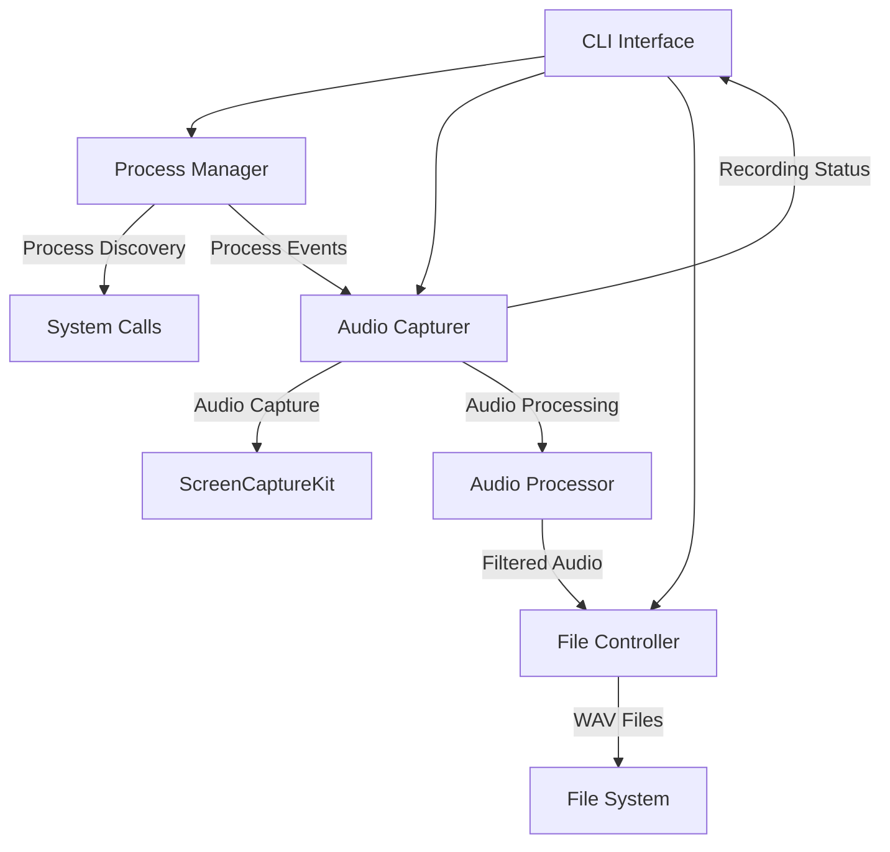

# Design Document

## Overview

The Audio Process Recorder is a command-line macOS application built with Swift that captures system audio using ScreenCaptureKit and filters it to record audio from specific processes identified by regular expression matching. The application leverages macOS Sequoia 15.6's ScreenCaptureKit framework to capture all system audio, then correlates this audio with target process activity to create filtered recordings.

## Architecture

### High-Level Architecture



### Component Interaction Flow

1. **CLI Interface** parses command-line arguments and coordinates other components
2. **Process Manager** discovers and monitors target processes using regex matching
3. **Audio Capturer** uses ScreenCaptureKit to capture system audio and correlates it with process activity
4. **Audio Processor** filters and mixes audio streams from target processes
5. **File Controller** manages WAV file creation, directory structure, and timestamped naming

## Components and Interfaces

### 1. CLI Interface (`AudioRecorderCLI`)

**Responsibilities:**
- Parse command-line arguments using Swift ArgumentParser
- Validate input parameters and permissions
- Coordinate application lifecycle
- Display real-time recording feedback

**Key Properties:**
```swift
struct AudioRecorderCLI: ParsableCommand {
    @Argument(help: "Regular expression to match process names")
    var processRegex: String
    
    @Option(name: .shortAndLong, help: "Output directory for recordings")
    var outputDirectory: String?
    
    @Flag(name: .shortAndLong, help: "Enable verbose logging")
    var verbose: Bool = false
}
```

**Interfaces:**
- `ProcessManagerDelegate` - Receives process discovery updates
- `AudioCapturerDelegate` - Receives recording status and duration updates

### 2. Process Manager (`ProcessManager`)

**Responsibilities:**
- Discover running processes using macOS system APIs
- Filter processes using regex matching against executable names and paths
- Monitor process lifecycle (start/stop events)
- Provide process metadata for audio correlation

**Key Methods:**
```swift
class ProcessManager {
    func discoverProcesses(matching regex: String) -> [ProcessInfo]
    func startMonitoring(delegate: ProcessManagerDelegate)
    func stopMonitoring()
}

struct ProcessInfo {
    let pid: pid_t
    let executableName: String
    let executablePath: String
    let bundleIdentifier: String?
}
```

**Implementation Details:**
- Uses `NSRunningApplication` for high-level process discovery
- Falls back to `sysctl` system calls for comprehensive process enumeration
- Implements regex matching using `NSRegularExpression`
- Monitors process events using `NSWorkspace` notifications

### 3. Audio Capturer (`AudioCapturer`)

**Responsibilities:**
- Configure and manage ScreenCaptureKit audio capture
- Correlate captured audio with target process activity
- Handle audio permissions and error states
- Provide real-time recording feedback

**Key Methods:**
```swift
class AudioCapturer: SCStreamDelegate {
    func startCapture(for processes: [ProcessInfo]) throws
    func stopCapture()
    func stream(_ stream: SCStream, didOutputSampleBuffer sampleBuffer: CMSampleBuffer, of outputType: SCStreamOutputType)
}
```

**ScreenCaptureKit Configuration:**
```swift
let streamConfig = SCStreamConfiguration()
streamConfig.capturesAudio = true
streamConfig.sampleRate = 48000
streamConfig.channelCount = 2
streamConfig.excludesCurrentProcessAudio = true
```

**Audio Correlation Strategy:**
- Capture all system audio via ScreenCaptureKit
- Monitor process CPU/memory usage to detect audio activity
- Use audio level analysis to identify when target processes are generating sound
- Apply temporal correlation between process activity and audio peaks

### 4. Audio Processor (`AudioProcessor`)

**Responsibilities:**
- Process raw audio sample buffers from ScreenCaptureKit
- Filter audio based on process correlation data
- Mix multiple process audio streams
- Convert audio to WAV format for file output

**Key Methods:**
```swift
class AudioProcessor {
    func processAudioBuffer(_ buffer: CMSampleBuffer, from processes: [ProcessInfo]) -> AVAudioPCMBuffer?
    func mixAudioStreams(_ streams: [AVAudioPCMBuffer]) -> AVAudioPCMBuffer?
    func convertToWAV(_ buffer: AVAudioPCMBuffer) -> Data
}
```

**Audio Processing Pipeline:**
1. Convert CMSampleBuffer to AVAudioPCMBuffer
2. Apply process-based filtering using correlation data
3. Mix audio from multiple target processes
4. Apply noise reduction and normalization
5. Convert to WAV format using Core Audio services

### 5. File Controller (`FileController`)

**Responsibilities:**
- Manage output directory creation and permissions
- Generate timestamped filenames
- Write WAV data to files
- Handle file system errors and disk space monitoring

**Key Methods:**
```swift
class FileController {
    func createOutputDirectory(_ path: String) throws
    func generateTimestampedFilename() -> String
    func writeAudioData(_ data: Data, to directory: String) throws -> URL
}
```

**File Naming Convention:**
- Format: `yyyy-MM-dd-HH-mm-ss.wav`
- Default location: `~/Documents/audiocap/`
- Automatic directory creation with proper permissions

## Data Models

### Process Information Model
```swift
struct ProcessInfo: Codable {
    let pid: pid_t
    let executableName: String
    let executablePath: String
    let bundleIdentifier: String?
    let startTime: Date
    var isActive: Bool
    var audioActivity: AudioActivityLevel
}

enum AudioActivityLevel {
    case silent
    case low
    case medium
    case high
}
```

### Recording Session Model
```swift
struct RecordingSession {
    let sessionId: UUID
    let startTime: Date
    var endTime: Date?
    let targetProcesses: [ProcessInfo]
    let outputFile: URL
    var duration: TimeInterval
    var fileSize: Int64
}
```

### Audio Configuration Model
```swift
struct AudioConfiguration {
    let sampleRate: Int = 48000
    let channelCount: Int = 2
    let bitDepth: Int = 16
    let maxDurationHours: Int = 12
    let bufferSize: Int = 4096
}
```

## Error Handling

### Error Types
```swift
enum AudioRecorderError: LocalizedError {
    case permissionDenied(PermissionType)
    case processNotFound(String)
    case audioCaptureFailed(SCStreamError)
    case fileSystemError(Error)
    case invalidRegex(String)
    case configurationError(String)
    
    enum PermissionType {
        case screenRecording
        case fileSystem
        case accessibility
    }
}
```

### Error Handling Strategy
- **Permission Errors**: Display step-by-step instructions for enabling required permissions
- **Process Errors**: Log warnings but continue with remaining processes
- **Audio Errors**: Attempt recovery with fallback configurations
- **File System Errors**: Provide alternative output locations
- **Graceful Degradation**: Continue operation with reduced functionality when possible

### Permission Management
```swift
class PermissionManager {
    func checkScreenRecordingPermission() -> Bool
    func requestScreenRecordingPermission()
    func displayPermissionInstructions(for type: PermissionType)
}
```

## Testing Strategy

### Unit Testing
- **Process Discovery**: Mock system APIs to test regex matching and process filtering
- **Audio Processing**: Test audio buffer manipulation and WAV conversion with sample data
- **File Operations**: Test directory creation, file naming, and error handling
- **CLI Parsing**: Test argument validation and help text generation

### Integration Testing
- **ScreenCaptureKit Integration**: Test audio capture with mock audio sources
- **Process Monitoring**: Test process lifecycle events and correlation
- **End-to-End Workflows**: Test complete recording sessions with simulated processes

### Testing Framework
```swift
// Using XCTest for unit and integration tests
class AudioRecorderTests: XCTestCase {
    func testProcessDiscovery()
    func testAudioCapture()
    func testFileOutput()
    func testErrorHandling()
}

// Mock implementations for testing
class MockProcessManager: ProcessManagerProtocol
class MockAudioCapturer: AudioCapturerProtocol
class MockFileController: FileControllerProtocol
```

### Performance Testing
- **Memory Usage**: Monitor memory consumption during long recording sessions
- **CPU Impact**: Measure CPU usage of audio processing and correlation
- **File I/O Performance**: Test write performance with large audio files
- **Process Monitoring Overhead**: Measure impact of continuous process monitoring

## Implementation Notes

### macOS-Specific Considerations
- **ScreenCaptureKit Requirements**: Requires macOS 12.3+ (Sequoia 15.6 fully supported)
- **Privacy Permissions**: Screen Recording permission required for ScreenCaptureKit
- **Sandboxing**: Application must handle sandbox restrictions for file access
- **Process Access**: Some system processes may be protected from enumeration

### Performance Optimizations
- **Audio Buffer Management**: Use circular buffers to minimize memory allocation
- **Process Monitoring**: Implement efficient polling intervals to balance accuracy and performance
- **File I/O**: Use background queues for file writing to avoid blocking audio capture
- **Memory Management**: Implement proper cleanup for audio buffers and temporary data

### Swift-Specific Implementation Details
- **Concurrency**: Use Swift's async/await for audio processing pipelines
- **Memory Safety**: Leverage Swift's automatic reference counting and memory safety
- **Error Handling**: Use Swift's Result type and throwing functions for robust error management
- **Protocol-Oriented Design**: Define protocols for all major components to enable testing and modularity

### Dependencies
- **ScreenCaptureKit**: System framework for audio capture
- **Swift ArgumentParser**: Command-line interface parsing
- **AVFoundation**: Audio processing and format conversion
- **Foundation**: Core system APIs and utilities
- **XCTest**: Testing framework (development dependency)