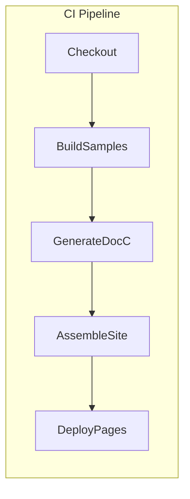

# Design Document

## Overview

The SDK Documentation system provides a full developer experience for integrating **AudioCap Core** into third-party applications. It combines an auto-generated API reference (Swift-DocC), curated conceptual guides, integration recipes, and CI-validated sample projects into a versioned static documentation site deployed with each release tag. The objective is to minimise time-to-first-audio for integrators while ensuring that documentation accuracy is continuously enforced by the build pipeline.

## Architecture

The solution is built around three main workflows:

1. **Documentation Authoring** – Maintainers write Markdown/DocC tutorials, guides, and recipes in the `Docs/` directory inside the repository. Inline code snippets are marked with DocC‐compatible directives to enable compilation testing.
2. **API Reference Generation** – A DocC plugin in `Package.swift` invokes `swift package generate-documentation` to extract public symbols from `Sources/Core` and produce HTML/JSON documentation bundles.
3. **Site Assembly & Deployment** – A GitHub Actions workflow stitches together authored content, generated API docs, and sample project artefacts into a static site that is deployed to GitHub Pages under a versioned path (e.g., `/docs/v1.4.0`). A landing page alias (`/docs/latest`) always points to the most recent stable release.

## Components and Interfaces

| Component | Responsibility | Interfaces |
|-----------|---------------|------------|
| **Doc Authoring Toolkit** | Collection of Markdown & DocC templates for guides, tutorials, and recipes. | DocC directives; `.md` files stored under `Docs/`. |
| **DocC Generator** | Automates `swift package generate-documentation` for Core module. | Invoked via SwiftPM plugin `docGen`. Outputs HTML & JSON bundle to `build/docs`. |
| **Sample Projects** | Minimal Xcode/SwiftPM workspaces that demonstrate common integrations (mono record, multichannel, adaptive bitrate). | Referenced in guides; validated by CI build matrix. |
| **Docs Site Builder** | Node-based static site generator (Docusaurus) that imports generated DocC bundles & authored guides. | `docs-site/` project; CLI `npm run build-docs`. |
| **Search Indexer** | Generates lunr.js index from JSON output of DocC for <200 ms search responses. | part of site build step. |
| **Version Switcher** | JavaScript widget that queries `/versions.json` and rewrites links. | Reads build-time manifest produced by CI. |
| **CI Workflow** | `.github/workflows/docs.yml` orchestrates sample compilation, doc generation, site build and deployment. | Triggered on `push` of tags `v*.*.*` & `main`. |

## Data Models

1. **Symbol Index** – JSON produced by DocC (`symbol-graph.json`) containing identifiers, declarations, availability, and deprecation flags.
2. **Guide Metadata** – Front-matter in Markdown guides (title, description, tags, minimum SDK version, sample-project path).
3. **Version Manifest** – `versions.json` list with `{ version, url, latest }` used by the version switcher.

## Error Handling

* **Build-time failures**: Any broken code snippet or sample project causes the CI job to fail, preventing deployment.
* **Link validation**: A `swift run link-checker` step crawls built HTML and fails if dead links are detected.
* **Deprecations**: Deprecated symbols are annotated by DocC; guides include callouts with alternatives.

## Testing Strategy

1. **Snippet Compilation Tests** – DocC compilation with the `--analyze` flag ensures every fenced Swift block compiles against the current SDK.
2. **Sample Project CI Matrix** – Each sample project is built for macOS and iOS targets.
3. **End-to-End Site Smoke Test** – After static site build, a headless browser script opens the landing page, performs a search, and verifies HTTP 200 responses for 20 random links.
4. **Version Regression Tests** – Latest two released versions are rebuilt nightly to confirm docs remain reproducible.

---

### Design Decisions & Rationale

* **Swift-DocC** is chosen for API reference as it integrates natively with SwiftPM and Xcode, assuring accurate symbol extraction.
* **Docusaurus** is selected for site assembly to leverage Markdown MDX flexibility, integrated search, and easy versioning.
* **CI-validated snippets** guarantee that documentation never drifts from the code-base, reducing maintenance burden.
* **Versioned deployment** prevents breaking changes for users pinned to older SDK releases.
